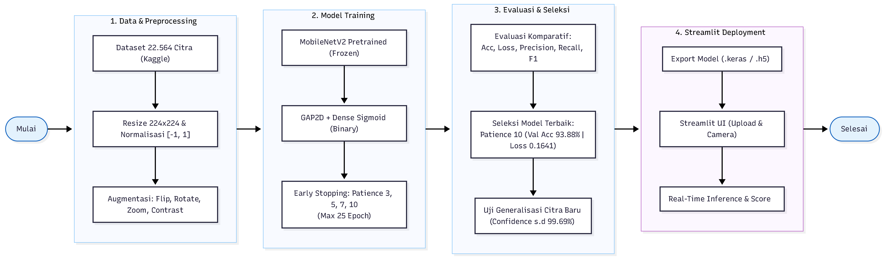

<div align="center">

[🇮🇩 Baca dalam Bahasa Indonesia](README.md) | [🇬🇧 Read in English](README.en.md)

# ♻️ Smart Waste Management: AI-Powered Classification

[](https://www.python.org)
[](https://www.tensorflow.org)
[](https://streamlit.io)
[](https://keras.io)
[](https://www.kaggle.com/datasets/techsash/waste-classification-data)
[](https://opensource.org/licenses/MIT)

**An Edge-Ready, Deep Learning Web Application for Automated Organic vs. Recyclable Waste Sorting.**

[**🚀 Launch Live Demo**](https://smartwastemanagement-bvasn5fbt3szlfmmnvvd6f.streamlit.app/)

</div>

---

> [!NOTE]  
> **Live Demo Notice (Streamlit Cloud)**  
> If you are accessing the live demo for the first time or after a period of inactivity, the application may take a moment to "wake up" from its cold-start sleep state. **You may need to refresh/reload the page once if it appears stuck or times out initially.** This is a standard container lifecycle behavior of the Streamlit Community Cloud free tier, not a runtime error or application bug. 

---

## 🚀 Executive Summary & Elevator Pitch

This project delivers an end-to-end Machine Learning pipeline utilizing Transfer Learning (MobileNetV2) to classify waste into **Organic** and **Recyclable** categories. Built with a focus on real-world applicability and deployment readiness, the model achieves near-production accuracy while maintaining a lightweight footprint suitable for future Edge AI integration. The solution is encapsulated in an interactive Streamlit web application, demonstrating seamless real-time inference and a robust user experience.

### 📊 Key Performance Metrics

| Metric | Value | Impact |
| :--- | :--- | :--- |
| **Validation Accuracy** | `93.88%` | High reliability for automated sorting systems. |
| **Validation Loss** | `0.1641` | Strong model generalization with minimal overfitting. |
| **Average F1-Score** | `94.00%` | Balanced precision and recall across both waste classes. |
| **Inference Confidence** | `91% - 99.69%` | Highly decisive predictions on real-world, unseen data. |
| **Data Volume** | `22,564 Images` | Trained on a robust, diverse Kaggle dataset. |

---

## 🗄️ Dataset Citation & Specifications

This project leverages the prominent **[Waste Classification Data](https://www.kaggle.com/datasets/techsash/waste-classification-data)** from Kaggle. 

- **Total Images:** 22,564 high-resolution images.
- **Classes:** Binary classification (Organic `O` vs. Recyclable `R`).
- **Data Split Strategy:** 
  - **Training Set (80%):** Utilized for model parameter optimization.
  - **Validation Set (20%):** Held out for unbiased evaluation and hyperparameter tuning during training.

---

## 🧠 Architecture & End-to-End Workflow

The pipeline employs a **MobileNetV2** backbone, pre-trained on ImageNet. The base layers are frozen to act as a powerful feature extractor, while a custom top block is appended and trained for this specific binary classification task.



---

## 🔬 Experimental Benchmarks & Engineering Trade-Offs

To optimize training efficiency and prevent overfitting, we conducted a rigorous comparative analysis using the **Early Stopping** callback by monitoring `val_accuracy` (with a maximum limit of 25 epochs) and enabling the `restore_best_weights=True` parameter.

### Early Stopping Patience Analysis

| Patience | Epochs Stopped | Best Epoch | Train Acc | Val Accuracy | Train Loss | Val Loss | Verdict |
| :---: | :---: | :---: | :---: | :---: | :---: | :---: | :--- |
| `3` | 18 | 15 | 93.36% | 93.84% | 0.1776 | 0.1652 | Computationally efficient (saves ~28% epoch duration). |
| `5` | 16 | 11 | 93.36% | 93.66% | 0.1773 | 0.1716 | Terminated prematurely at a local optimum. |
| `7` | 22 | 15 | 93.36% | 93.84% | 0.1776 | 0.1652 | Stable, restores identical weights as Patience 3. |
| **`10`** | **25** | **25** | **93.73%** | **93.88%** | **0.1677** | **0.1641** | **Absolute best performance (lowest validation loss).** |

**Engineering First-Principles Analysis:**
In Edge AI scenarios, training compute is less of a bottleneck than inference latency. However, during the training phase, setting patience to 10 proved to yield the most optimal performance (lowest loss). There is a clear computational trade-off: the accuracy improvement margin from Patience 7 (93.84% at epoch 22 / best epoch 15) to Patience 10 (93.88% at epoch 25) is only 0.04%. This slight 0.04% increase requires full execution up to epoch 25 to strictly minimize the validation loss to 0.1641. Meanwhile, configurations with tighter tolerances (like Patience 3 or 7) are already capable of securing a 93.84% performance earlier, saving compute resources. Ultimately, Patience 10 allows the optimizer (Adam) to navigate local minima more effectively, resulting in the absolute best model performance.

---

## 🎯 Model Evaluation

The model demonstrates exceptional balance, effectively mitigating the common pitfall of biasing towards the majority class.

### Classification Report (Validation Set)

| Class | Precision | Recall | F1-Score |
| :--- | :---: | :---: | :---: |
| **Organic (O)** | 0.96 | 0.93 | **0.94** |
| **Recyclable (R)** | 0.92 | 0.95 | **0.93** |
| *Macro Avg / Overall* | *0.94* | *0.94* | **0.94** |

---

## 💻 Web App Features & Local Quickstart

The Streamlit application is designed for intuitive interaction and robust error handling.
- **Features:** File Upload (JPG/PNG), Live Camera Input, Real-time Inference, Visual Confidence Gauge, Cached Model Loading (`@st.cache_resource`) for fast execution.

### Local Setup Instructions

1. **Clone the Repository:**
   ```bash
   git clone https://github.com/Ari-1711/smart-waste-management.git
   cd smart-waste-management
   ```

2. **Create a Virtual Environment (Recommended):**
   ```bash
   python -m venv venv
   # On Windows:
   venv\Scripts\activate
   # On macOS/Linux:
   source venv/bin/activate
   ```

3. **Install Dependencies:**
   ```bash
   pip install -r requirements.txt
   ```

4. **Run the Streamlit App:**
   ```bash
   streamlit run app.py
   ```

---

## 📂 Project Directory Tree

```text
smart_waste_management/
│
├── .agents/                   # Custom agent skills and configurations
├── .codex/                    # Hooks configuration for agents
├── data/                      # Dataset and processed images folder
├── docs/                      
│   └── assets/                # Documentation assets (e.g., flow diagrams)
├── models/
│   └── mobilenetv2_waste.keras # Pre-trained Keras model weights (frozen)
├── notebooks/
│   └── swm_model.ipynb        # Model architecture, training, and evaluation notebook
├── src/
│   └── predictor.py           # Inference logic and image preprocessing functions
├── app.py                     # Main Streamlit application entry point
├── requirements.txt           # Project dependencies
├── .gitignore                 # Git ignore rules
├── README.en.md               # Project documentation (English version - You are here)
└── README.md                  # Project documentation (Indonesian version)
```

---

## 👥 Authors, Roles & Contribution Breakdown

This project originated as academic research at **Universitas Mercu Buana** and was subsequently scaled into a production-ready web application.

- **Ari Hermawan** — *Lead ML Engineer & Streamlit Developer*
  - Designed model architecture, preprocessing, and augmentation pipelines.
  - Engineered the Early Stopping experimentation framework and trained the model.
  - Developed, optimized, and deployed the interactive Streamlit web application.
- **Royhan Achmad** — *Academic Researcher*
  - Conducted extensive literature reviews and compiled theoretical foundations.
  - Managed reference formatting and structured the academic report documentation.
- **Adistya Firdaus** — *Academic Researcher*
  - Led dataset validation and integrity checks.
  - Executed comparative reporting and finalized technical documentation.
- **Essy Malay Sari Sakti, S.Kom., M.M.S.I.** — *Advisor / Dosen Pembimbing*
  - Provided strategic guidance, academic oversight, and project validation.

---

## 🛠️ Tech Stack & Future Roadmap

**Core Technologies:**
- **Languages:** Python 3.10+
- **Deep Learning:** TensorFlow 2.x, Keras, MobileNetV2
- **Data Processing:** NumPy, Pillow (PIL)
- **Frontend / Deployment:** Streamlit, Streamlit Community Cloud

**Future Roadmap:**
1. **Edge Deployment:** Optimize the model utilizing TensorFlow Lite for deployment on resource-constrained Edge IoT devices (e.g., NVIDIA Jetson Nano, Raspberry Pi) integrated with physical sorting bins.
2. **Multi-Class Expansion:** Expand the dataset and retrain the model to classify sub-categories (e.g., Glass, Plastic, Paper, Metal, E-Waste) to support more granular recycling processes.
3. **Continuous Learning:** Implement a feedback loop in the web app to collect misclassified images for future model retraining.
